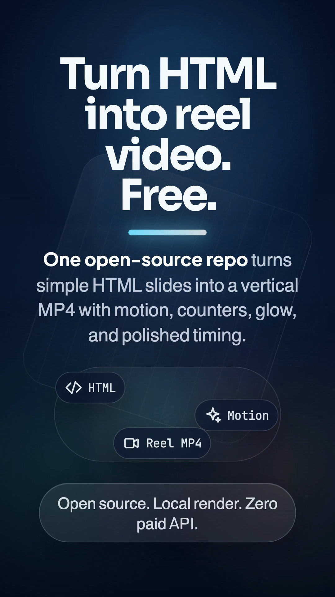
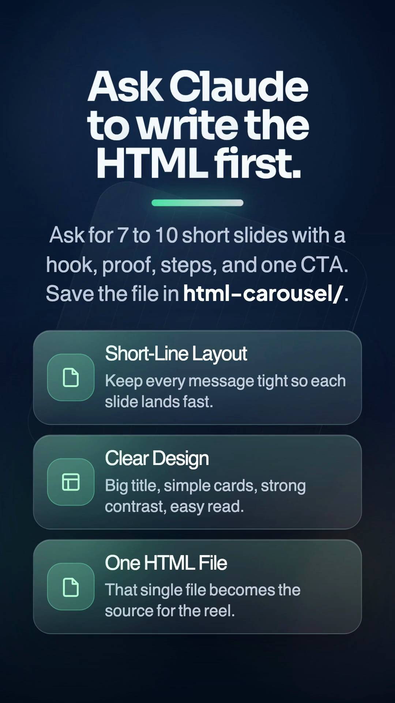
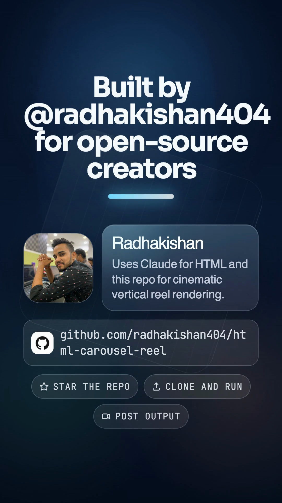
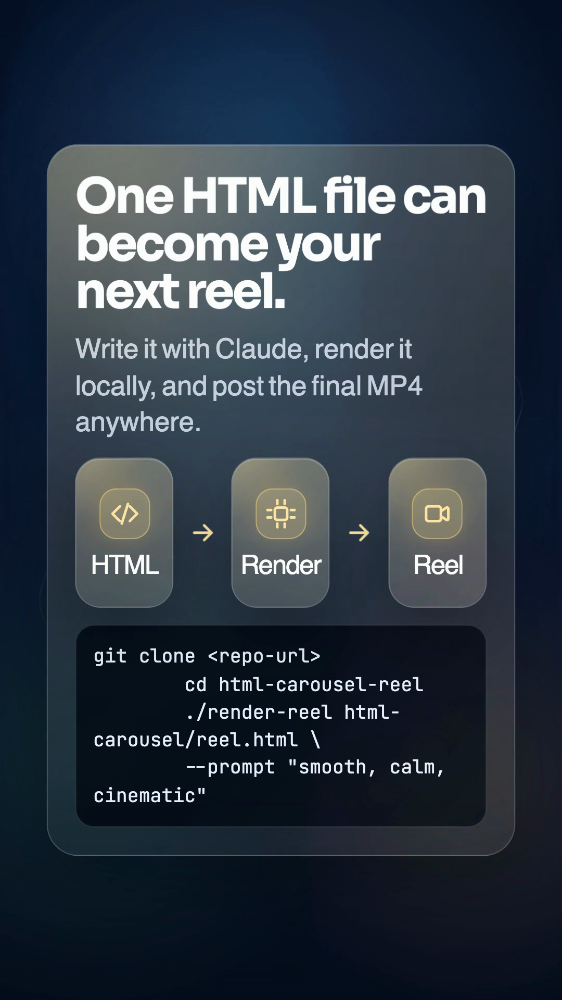

# HTML Carousel Reel

Convert a static HTML carousel into a vertical reel video on your own machine.

This repo takes a `.html` file with `.slide` sections, compiles it into a [HyperFrames](https://github.com/heygen-com/hyperframes) composition, adds motion, counters, staggered reveals, glow, and pacing, then exports a final `.mp4`.

No paid video API. No hosted render dependency. Just HTML in, reel out.

[](./LICENSE)
[](./README.md)
[](./README.md)

## Demo

**Sample reel:** [`create_html_to_reel_carousel_reel.mp4`](./html-carousel/create_html_to_reel_carousel_reel.mp4)

Click the preview below to open the MP4 from the repo:

[](./html-carousel/create_html_to_reel_carousel_reel.mp4)

More demo frames:

| Build flow | Creator slide | Final CTA |
| --- | --- | --- |
|  |  |  |

## Try This Example First

Clone the repo, install once, and render the starter reel:

```bash
git clone https://github.com/radhakishan404/html-carousel-reel.git
cd html-carousel-reel
npm install
./render-reel ./html-carousel/create_html_to_reel_carousel.html \
  --prompt "smooth, cinematic, storytelling" \
  --quality standard
```

Output:

```text
html-carousel/create_html_to_reel_carousel_reel.mp4
```

## What This Repo Does

- Converts HTML carousel slides into vertical MP4 reels
- Adds animation per slide instead of doing a flat screen recording
- Supports prompt-driven motion styling like `cinematic`, `smooth`, `fast`, `clean`, `glow`
- Exports locally beside the source HTML file
- Works well for creator reels, product explainers, launch videos, and carousel-to-video repurposing

## How It Works

1. You create an HTML carousel file with `.slide` sections.
2. This repo detects the slides and builds a temporary HyperFrames composition.
3. It injects motion timelines for text, cards, counters, icons, bars, and ambient light.
4. HyperFrames renders the final reel locally.
5. The MP4 is saved next to the source HTML.

## Quick Start

### Requirements

- Node.js `20+`
- `ffmpeg` on `PATH`
- macOS, Linux, or Windows with Node + FFmpeg

### Install

```bash
git clone https://github.com/radhakishan404/html-carousel-reel.git
cd html-carousel-reel
npm install
```

### Render One Reel

```bash
./render-reel ./html-carousel/create_html_to_reel_carousel.html \
  --prompt "smooth, cinematic, storytelling" \
  --quality standard
```

Output:

```text
html-carousel/create_html_to_reel_carousel_reel.mp4
```

## Examples

Use these sample files to test different storytelling styles quickly:

| HTML source | Reel output | Use case |
| --- | --- | --- |
| [`create_html_to_reel_carousel.html`](./html-carousel/create_html_to_reel_carousel.html) | [`create_html_to_reel_carousel_reel.mp4`](./html-carousel/create_html_to_reel_carousel_reel.mp4) | Full creator-facing flagship demo |
| [`local_html_to_reel_launch_carousel.html`](./html-carousel/local_html_to_reel_launch_carousel.html) | [`local_html_to_reel_launch_carousel_reel.mp4`](./html-carousel/local_html_to_reel_launch_carousel_reel.mp4) | Short launch reel focused on the local workflow |
| [`claude_html_to_reel_workflow_carousel.html`](./html-carousel/claude_html_to_reel_workflow_carousel.html) | [`claude_html_to_reel_workflow_carousel_reel.mp4`](./html-carousel/claude_html_to_reel_workflow_carousel_reel.mp4) | Claude-to-HTML-to-reel workflow demo |

## Input Format

Your source HTML should contain top-level `.slide` blocks.

Example structure:

```html
<section class="slide">
  <h1>Hook</h1>
  <p>One clear idea per slide.</p>
</section>
<section class="slide">
  <h2>Proof</h2>
  <div class="stat-card">...</div>
</section>
```

Tips for better reel output:

- Keep one message per slide
- Use short lines and strong hierarchy
- Prefer large text and obvious contrast
- Use grouped cards, counters, lists, or flow blocks
- Build for `9:16` instead of desktop layouts

## Prompt-Driven Style

You can steer motion behavior with plain-English prompts:

```bash
./render-reel ./html-carousel/github_repos_for_claude_code_carousel.html \
  --prompt "cinematic, glow, smooth, premium" \
  --seconds-per-slide 4.8
```

Useful style words:

- `cinematic`, `movie`, `epic`
- `smooth`, `soft`, `elegant`
- `fast`, `punchy`, `viral`
- `minimal`, `clean`, `subtle`
- `glow`, `light`, `shiny`

## Common Commands

```bash
# Render one file
npm run render:reel -- ./html-carousel/coding_mistakes_beginners_carousel.html

# Render one file with custom output path
npm run render:reel -- ./html-carousel/career_ops_hindi_carousel.html \
  --output ./html-carousel/career_ops_hindi_custom.mp4

# Render every HTML file in html-carousel/
npm run render:all

# Batch render with a shared motion prompt
npm run render:all -- --prompt "cinematic, glow, bold" --seconds-per-slide 3.2
```

## Repo Structure

```text
scripts/
  render-carousel-reel.mjs   # main compiler + animation timeline builder
  render-all.mjs             # batch rendering helper
render-reel                  # shell wrapper for single renders
html-carousel/               # example and source carousel HTML files
docs/demo/                   # README screenshots from the sample reel
```

## Example Workflow

A practical creator workflow looks like this:

1. Ask Claude to create a 7 to 10 slide HTML carousel.
2. Save it in `html-carousel/`.
3. Render it with `./render-reel`.
4. Add voiceover or music outside this repo if needed.
5. Publish the final MP4 to Reels, Shorts, or X.

## Why Open Source

This repo exists for creators who want:

- a local reel pipeline
- source-controlled visual storytelling
- no pay-per-render tooling
- reusable HTML-based creative assets

## Launch Copy

Ready-to-post launch copy lives in [`docs/launch/launch-copy.md`](./docs/launch/launch-copy.md) for:

- X
- LinkedIn
- Reddit
- Instagram
- pinned comments

## Contributing

Issues and pull requests are welcome.

High-value contributions:

- better motion presets
- more resilient HTML pattern support
- richer demo templates
- improved renderer diagnostics
- cross-platform render reliability

See [CONTRIBUTING.md](./CONTRIBUTING.md).

## License

MIT. See [LICENSE](./LICENSE).
